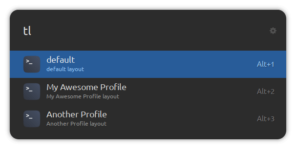

# ulauncher-terminator-layouts

[Ulauncher](https://ulauncher.io) extension for launching Terminator using a chosen layout.

## Screenshot



## Requirements

- [Ulauncher](https://ulauncher.io)
- [Python 3](https://www.python.org/)
- [Terminator](https://terminator-gtk3.readthedocs.io/en/latest/)

## Install

Open ULauncher Preferences -> Extensions -> add extension and paste the following url:

```
https://github.com/kleber-swf/ulauncher-terminator-layouts
```

## Credits
* Preview Theme: [Orchis Dark](https://github.com/kleber-swf/orchis-dark-ulauncher)
* Icon: [Reversal Icon Theme](https://github.com/yeyushengfan258/Reversal-icon-theme)
